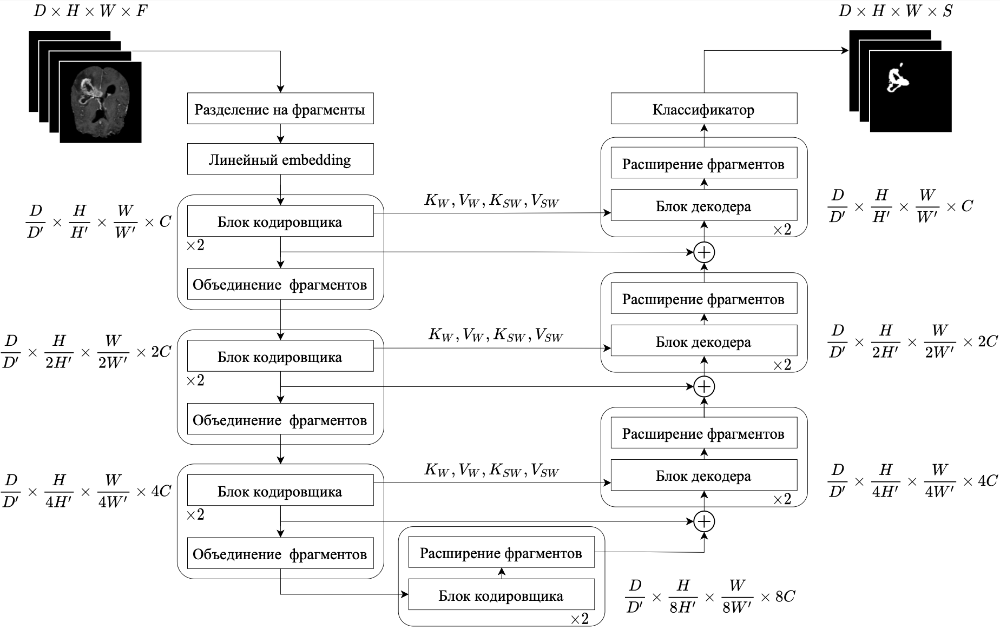
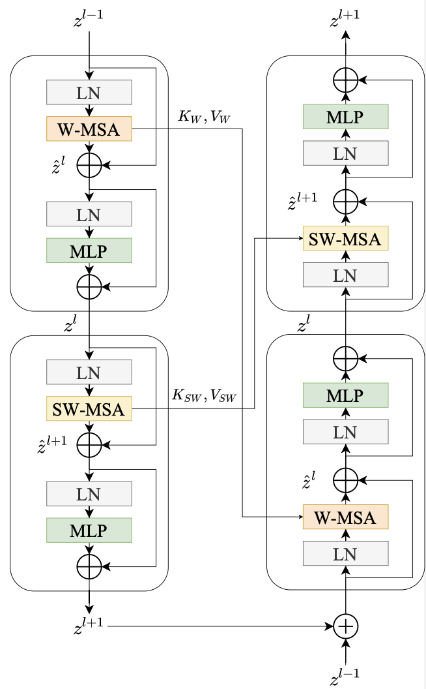

# MSNet:  Volumetric Medical Image Segmentation model based on 3D Swin Transformer





[Training process at Tensorboard.dev](https://tensorboard.dev/experiment/FeyEEXLxSPS0gTjkyDX2Ig/#scalars&_smoothingWeight=0.934)

## System requirements

- CUDA 11.0 and above
- GPU with at least 
    - 10GB for training with `batch_size == 1`, 
    - 18GB for training with `batch_size == 2`, 
    - 25GB for training with `batch_size == 3`.

## Setup

1. Clone the repository:
   ```bash
   git clone https://github.com/ynjiya/msnet.git
   cd msnet
2. Create a virtual environment with `Python 3.9.16` using your preferred Python environment manager and install dependencies:
    ```bash
    pip install -r requirements.txt
3. Make sure to install pytorch, that is compatible withwith `Python 3.9.16` and your CUDA version


## Data

1. Download `.tar` for any task from http://medicaldecathlon.com/ and save it in the `data` directory

2. Extract the downloaded `.tar` file:
    ```bash
    tar -xf data/Task01_BrainTumour.tar -C data/
3. Update the path to the dataset in the `config.py` if the dataset is somewhere else:
    ```python
    MAIN_DATA_FOLDER_MSD = "./data/Task01_BrainTumour/"
## Swin-T Pre-Trained weights

Swin-T pre-trained weights on ImageNet22k is used for initialization of model parameters. Download pre-trained weights from https://github.com/SwinTransformer/storage/releases/download/v1.0.0/swin_tiny_patch4_window7_224.pth and add it under `pretrained_ckpt` folder

## Train
```bash
python train.py
```

## Test on testing set
```bash
python test.py 
```

## Evaluate on unseen data
1. Put the unseen data in `user_test/in`.

2. Run the inference script
    ```bash
    python run.py 
    ```
## Acknowledgements
This repository makes liberal use of code from [Swin Transformer](https://github.com/microsoft/Swin-Transformer), [Video Swin Transformer](https://github.com/SwinTransformer/Video-Swin-Transformer), [Swin-Unet](https://github.com/HuCaoFighting/Swin-Unet) and [VT-UNet](https://github.com/himashi92/VT-UNet)


